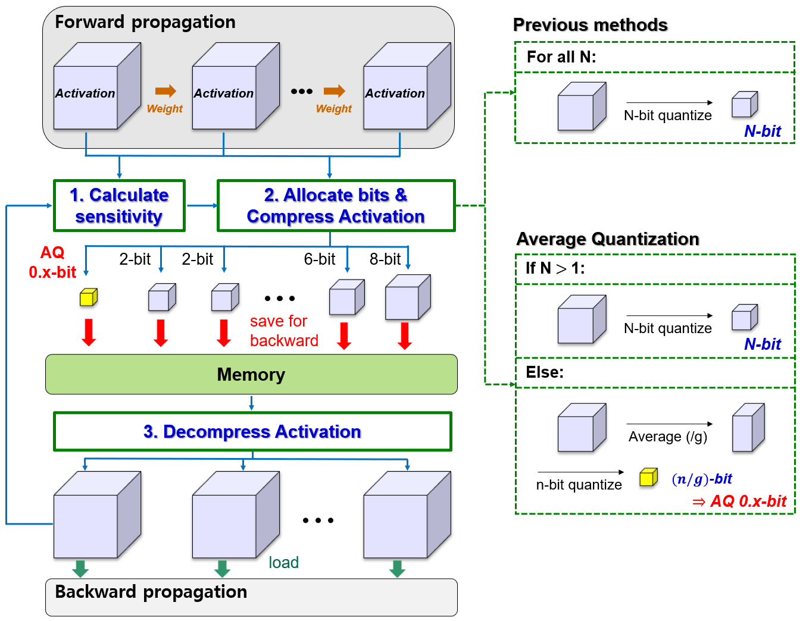
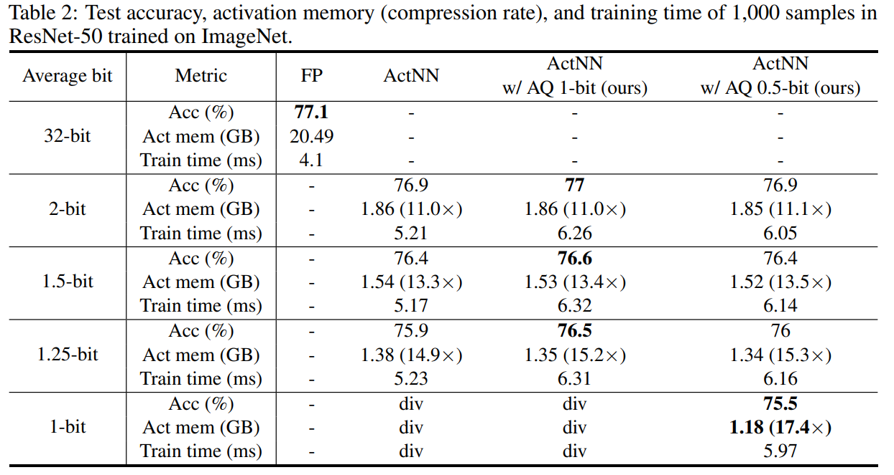
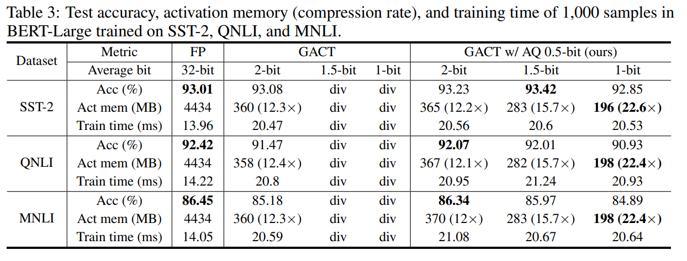

# Average Quantization: High-Quality 0.x-bit Activation to Reduce Memory Usage for Training

This repository is the official implementation of https://openreview.net/forum?id=BG7H1XsMG0.

+ We prove that approximating activations with their average values minimizes the gradient variance from actual activations.
+  We propose Average Quantization which can generate high-quality sub-1b activations.
+  By adopting the proposed sub-1b precision in sensitivity-based activation compression training, we can allocate more bits to activations with high sensitivity than with previous algorithms, thus improving the accuracy-memory saving trade-off.

## Abstract

As the size of deep learning models increases, their performance improves according to scaling laws. However, training such large models requires a significant amount of memory and hence cannot be realized without a considerable number of expensive GPUs. Recently proposed activation compression techniques alleviate memory requirements by compressing activations with different compression rates based on their sensitivity to minimize accuracy degradation. However, when we deeply compress activations with the target precision close to 1 bit, a large portion of activations would be represented in 1 bit regardless of their sensitivity since sub-1b precision is not supported in those methods, severely degrading training accuracy. To address this issue, we propose to represent a group of activations with a single approximate value, effectively producing sub-1b activations. We prove that the boundary function for the gradient difference between the actual and the approximate activation is minimized when the activations are approximated using their average values. Based on this observation, we propose Average Quantization which provides high-quality sub-1b activations by replacing a group of activations with a single average value. By assigning sub-1b precision to activations with low sensitivity, we can allocate more bits to activations with higher sensitivity, which can result in a better trade-off between accuracy and memory saving. In experiments, the proposed Average Quantization successfully trains various models with a high compression rate of up to 22.6x, translating to a significantly higher compression rate for similar training performance compared to prior methods.



## Install

### 1. ActNN with AQ
+ Requirements
```bash
cd sens_act_with_aq/requirements
conda env create -f actnn_aq.yaml
```
+ Buld actnn_aq:
```bash
conda activate actnn_aq
cd sens_act_with_aq/actnn_aq
pip install -v -e .
```

### 2. GACT with AQ
+ Requirements
```bash
cd sens_act_with_aq/requirements
conda env create -f gact_aq.yaml
```
+ Buld gact_aq:
```bash
conda activate gact_aq
cd sens_act_with_aq/gact_aq
pip install -v -e .
```

## Usage 

### 1. ActNN with AQ
```python
import actnn_aq
actnn_aq.set_optimization_level("L3", bit=args.bit, aq_bit=args.aq_bit) # set the optmization level, average bit of total activations, and AQ 0.x-bit. More config info can be seen in actnn_aq/conf.py and Table. 2 of ActNN paper(https://arxiv.org/pdf/2104.14129.pdf)
model = .... # define your model here
model = actnn_aq.QModule(model)
model = model.cuda() # Convert the model before calling `.cuda()`.
```

### 2. GACT with AQ
```python
from gact_aq.controller import Controller # import gact_aq controller
gact_aq.set_optimization_level(level='L2', bit=1, aq_bit=0.5, gactnorm =True) # set the optmization level, average bit of total activations, AQ 0.x-bit, and whether applying gactnorm or not. More config info can be seen in gact_aq/conf.py and Table. 1 of GACT paper(https://arxiv.org/pdf/2206.11357.pdf)
model = .... # define your model here
controller = Controller(model)
controller.install_hook()

# training logic
for epoch in ...
  for iter in ....
    ......
    def backprop():
        model.train() # make sure you are in the training mode
        output = model(input) # forward
        loss = calculate_loss()
        optimizer.zero_grad() # this line must be present!
        loss.backward() # backward

    optimizer.step() # update the parameters
    controller.iterate(backprop) # tell gact how to perform forward/backward

controller.uninstall_hook()
```
## Results

### 1. Vision

### 2. Text classification

## Example

[ResNet](https://github.com/asdgasdf/Average_Quantization/tree/main/benchmark/vision)

[BERT_L](https://github.com/asdgasdf/Average_Quantization/tree/main/benchmark/text_classification)

 
## Acknowledgments
  
  In this repository, code of [ActNN](https://github.com/ucbrise/actnn) and [GACT](https://github.com/LiuXiaoxuanPKU/GACT-ICML) are modified to apply with our Averge Quantization.
  Thanks the authors for open-source code.
  
 ## Lisense

> All content in this repository is licensed under the MIT license. 

